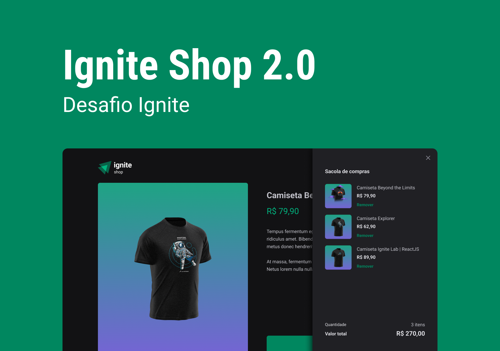

<h1 align="center"> GitHub Blog </h1>

Este é mais um desafio proposto no curso IGNITE da Rocketseat. 
 
Cada módulo é desenvolvido uma aplicação e após é proposto um desafio para testar os conhecimentos.
 

  <a href="#-tecnologias">Tecnologias</a>&nbsp;&nbsp;&nbsp;|&nbsp;&nbsp;&nbsp;
  <a href="#-projeto">Projeto</a>&nbsp;&nbsp;&nbsp;|&nbsp;&nbsp;&nbsp;
  <a href="#-layout">Layout</a>&nbsp;&nbsp;&nbsp;|&nbsp;&nbsp;&nbsp;
  <a href="#-layout">Executando</a>&nbsp;&nbsp;&nbsp;|&nbsp;&nbsp;&nbsp;
  <a href="#memo-licença">Licença</a>

  

 

  

## 🚀 Tecnologias

Esse projeto foi desenvolvido com as seguintes tecnologias:

- Next.JS
- Git e Github
- Figma
- API do Stripe
- Axios
- TypeScript
- Stitches

## 💻 Projeto

Ignite Shop 2.0.

No módulo criamos um projeto completo com o framework Next.js. Utilizamos StitchesJS, passando por conceitos de SPA, server-side rendering (SSR) e static-site generation (SSG).

Já para o desafio a ideia era evoluir o projeto do módulo, fazendo checkout dos produtos cadastrados no stripe, criar um sacolinha para os itens selecinados e renderizá-los na página de sucesso após o checkout concluído com sucesso.

- [Visite o projeto online](https://ignite-04-desafio-ignite-shop.vercel.app/)

## 🛠️ Executando

- Clone o projeto e instale as dependências (npm install)
- Será necessário criar um conta no stripe para gerar as chaves
- Crie um arquivo .env.local (segue exemplo de como são as keys no arquivo .env.local.example)
- Após se cadastrar basta pegar a chave pública e a privada e colá-las no seu .env.local
- Informe também o endereço que rodará seu projeto no arquivo .env.local, pois ele é usado para o checkout do stripe.
- Por padrão ao rodar local será no porta 3000, mas verifique se não foi trocada e informe no .env.local 
- Agora é só rodar o projeto com npm run dev.

## 🔖 Layout

Você pode visualizar o layout do projeto através 
[DESSE LINK](https://www.figma.com/file/63BY4AOFzu9pGKdJG60m1s/Ignite-Shop-2.0-(Copy)?node-id=0%3A1&t=i2EaOSHBXKLg4loi-0). É necessário ter conta no [Figma](https://figma.com) para acessá-lo.

## :memo: Licença

Esse projeto está sob a licença MIT.

---
